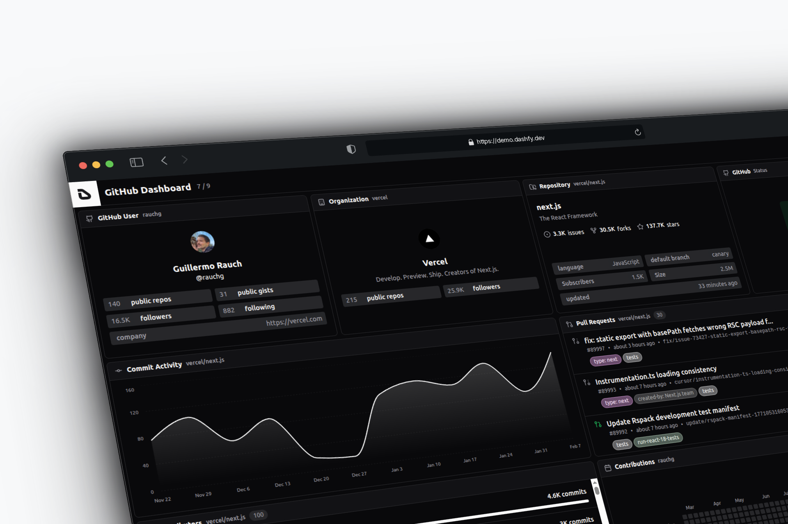
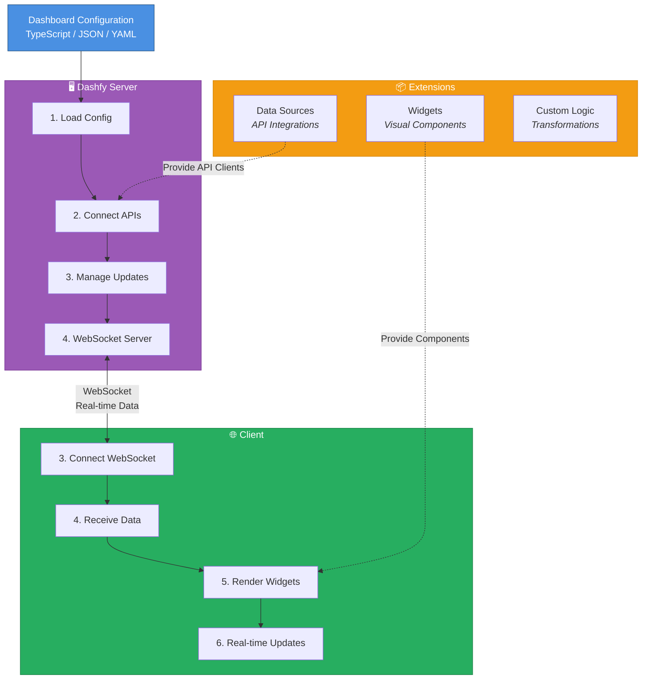
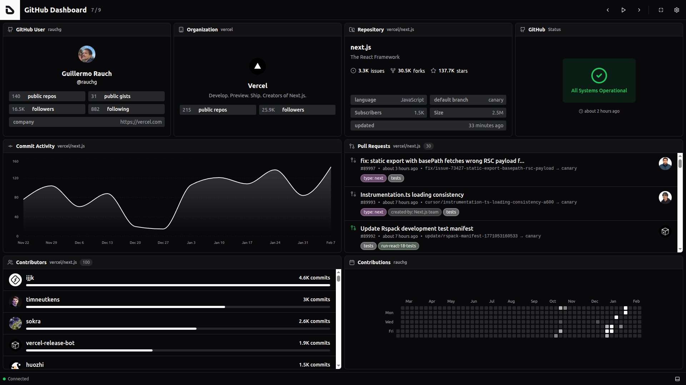
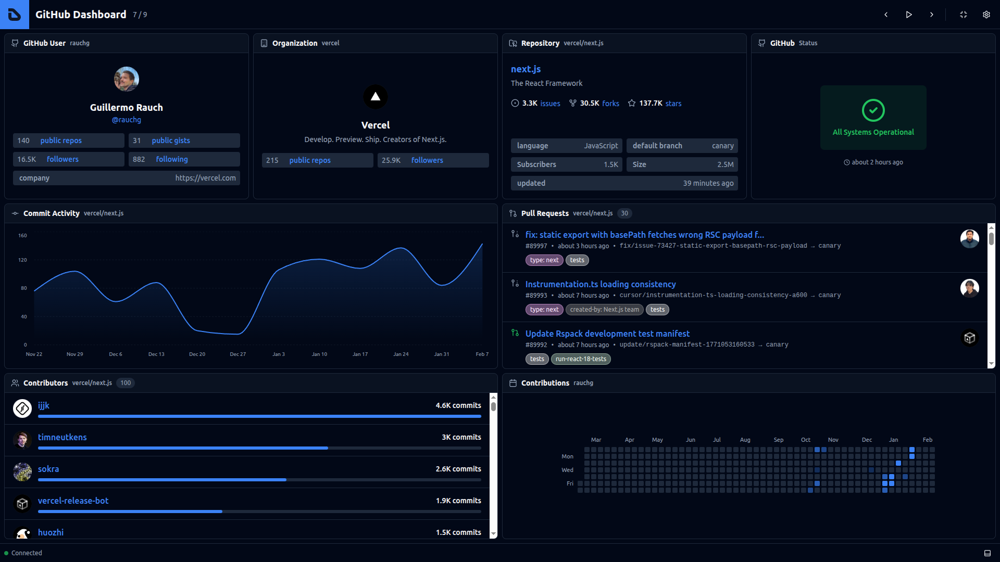
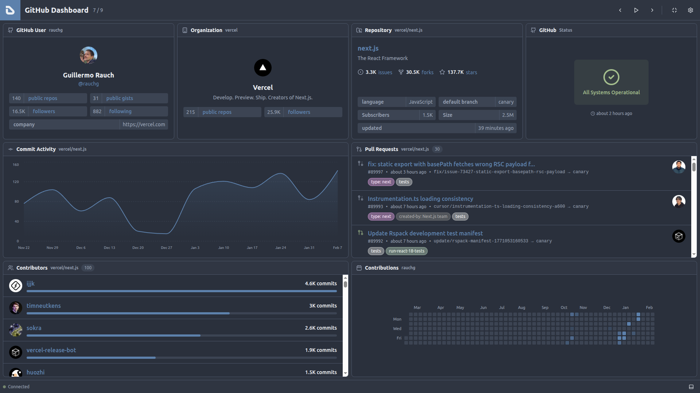
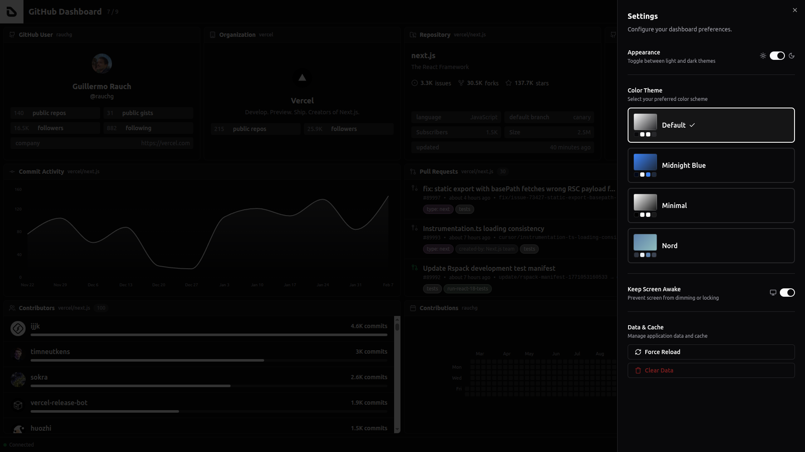
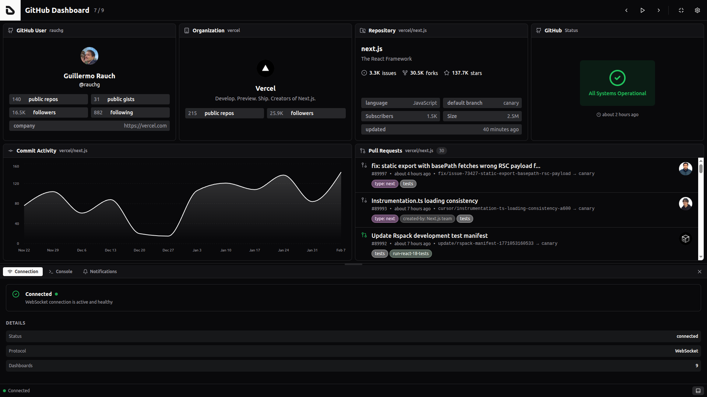
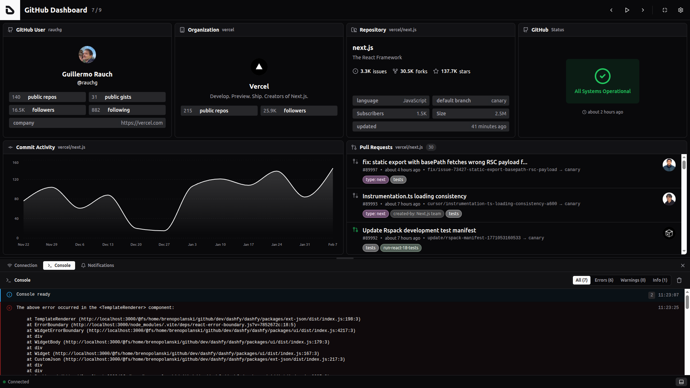

<p align="center">
  
</p>

<h1 align="center">
  Dashfy - Dashboards for developers
</h1>
<p align="center">
  Define dashboards as code. Connect APIs. Render real-time interfaces.
</p>

<p align="center">
  <a href="https://demo.dashfy.dev">Demo</a>
  <span>&nbsp;&nbsp;•&nbsp;&nbsp;</span>
  <a href="https://docs.dashfy.dev">Docs</a>
  <span>&nbsp;&nbsp;•&nbsp;&nbsp;</span>
  <a href="https://github.com/orgs/dashfy/projects/1">Roadmap</a>
  <span>&nbsp;&nbsp;•&nbsp;&nbsp;</span>
  <a href="https://dashfy.dev/discord">Discord</a>
  <span>&nbsp;&nbsp;•&nbsp;&nbsp;</span>
  <a href="https://github.com/sponsors/brenopolanski">Sponsor</a>
</p>

## Introduction

**Dashfy** is an open-source framework for building dashboards using declarative configuration.

Instead of manually building dashboards in a UI, developers define dashboards as structured configuration. Dashfy connects to APIs and data sources, composes widgets, and renders real-time interfaces.

Dashfy is designed to make dashboards:

- developer-friendly
- composable
- extensible
- and maintainable

Dashfy is published as a set of npm packages (for example `@dashfy/server`, `@dashfy/ui`, `@dashfy/themes`, and `@dashfy/ext-*`).

This repository is the monorepo for Dashfy packages and includes runnable, standalone project templates under `templates/` (`vite-app`/`astro-app`/`next-app`/`react-router-app`/`start-app` are full demos, `vite-starter`/`astro-starter`/`next-starter`/`react-router-starter`/`start-starter` are minimal starting points). The [`dashfy` CLI](./packages/cli) scaffolds new apps from these templates and resolves extensions from the registry hosted by `apps/registry` (`registry.dashfy.dev`).

Inspired by the [Mozaïk](https://github.com/plouc/mozaik) project by [@plouc](https://github.com/plouc).

[](https://demo.dashfy.dev)

> _A live demo is available at: [demo.dashfy.dev ⇗](https://demo.dashfy.dev)_

### :heart: Found this project useful?

If you found this project useful, then please consider giving it a :star: on GitHub and sharing it with your friends via social media. It helps to promote the project and attract more contributors.

## Sponsors

Dashfy is a free and open-source project, but it is not free to run and develop. If you want to support the project, you can become a sponsor on [GitHub Sponsors](https://github.com/sponsors/brenopolanski). If you are a company, you can also contact me to discuss a sponsorship on <sponsor@dashfy.dev>.

<table width="100%">
  <tr height="187px">
    <td align="center" width="33%">
      <a href="mailto:sponsor@dashfy.dev">
        Add your logo here
      </a>
    </td>
  </tr>
</table>

## Why Dashfy

Dashboards are everywhere.

Developers build dashboards to monitor systems, track metrics, visualize APIs, and power internal tools. But building and maintaining dashboards is harder than it should be.

Traditional dashboards are often:

- tightly coupled to UI implementations
- difficult to version and review
- hard to extend and evolve
- manually constructed and maintained

Over time, dashboards become fragile systems instead of reliable interfaces.

Dashfy was created to solve this problem.

Dashfy treats dashboards as structured configuration instead of handcrafted UI. Developers define dashboards declaratively, connect APIs and data sources, and Dashfy handles rendering, real-time updates, and composition.

This approach makes dashboards:

- easier to maintain
- easier to version
- easier to extend
- easier to reproduce across environments

Dashfy is built for developers who want dashboards that integrate naturally with their codebase, infrastructure, and APIs.

## How Dashfy is Different

Dashfy is designed around a simple principle: dashboards should be defined as code, not built manually in a UI.

This changes how dashboards are created, maintained, and extended.

#### » Declarative, not manual

Traditional dashboards are constructed manually through graphical interfaces.

Dashfy dashboards are defined using structured configuration. This makes them easier to version, review, and maintain.

#### » Developer-first

Dashfy is designed for developers and integrates naturally with modern workflows:

- version control
- CI/CD pipelines
- code review
- infrastructure as code

Dashboards become part of your system, not external tools.

#### » API-native

Dashfy connects directly to APIs and data sources through extensions.

Instead of being tied to a specific backend or database, Dashfy can compose dashboards from any system.

#### » Extensible architecture

Dashfy uses extensions to add widgets and data sources.

You can build custom integrations without modifying the core, making Dashfy adaptable to any environment.

#### » Real-time by default

Dashfy uses a server–client architecture with WebSockets and subscriptions, enabling dashboards to update automatically as data changes.

No polling hacks. No manual refresh.

#### » Composable and reproducible

Dashboards are defined as configuration and can be:

- versioned
- reused
- shared
- reproduced across environments

This makes Dashfy suitable for both local development and production systems.

## Configuration

Dashfy dashboards are defined using declarative configuration. You can use `TypeScript` object, `JSON` or `YAML` to define your dashboards. To learn more about the configuration options, please refer to the [configuration documentation](https://docs.dashfy.dev/configuration).

<details>
  <summary>TypeScript Example</summary>
  <br>

```ts
import type { DashfyConfig } from '@dashfy/types'

const dashfyConfig: DashfyConfig = {
  dashboards: [
    {
      title: 'GitHub Dashboard',
      columns: 3,
      rows: 2,
      widgets: [
        {
          extension: 'github',
          widget: 'RepoBadge',
          x: 0,
          y: 0,
          columns: 1,
          rows: 1,
          repository: 'facebook/react',
        },
        {
          extension: 'github',
          widget: 'PullRequests',
          x: 1,
          y: 0,
          columns: 2,
          rows: 1,
          repository: 'vercel/next.js',
          state: 'open',
        },
        {
          extension: 'json',
          widget: 'JsonStatus',
          x: 0,
          y: 1,
          columns: 3,
          rows: 1,
          title: 'API Status',
          url: 'https://api.example.com/health',
          statuses: [
            {
              assert: 'equals(status, ok)',
              status: 'success',
              label: 'API Online',
            },
          ],
        },
      ],
    },
  ],
}
```

</details>

<details>
  <summary>JSON Example</summary>
  <br>

```json
{
  "dashboards": [
    {
      "title": "GitHub Dashboard",
      "columns": 3,
      "rows": 2,
      "widgets": [
        {
          "extension": "github",
          "widget": "RepoBadge",
          "x": 0,
          "y": 0,
          "columns": 1,
          "rows": 1,
          "repository": "facebook/react"
        },
        {
          "extension": "github",
          "widget": "PullRequests",
          "x": 1,
          "y": 0,
          "columns": 2,
          "rows": 1,
          "repository": "vercel/next.js",
          "state": "open"
        },
        {
          "extension": "json",
          "widget": "JsonStatus",
          "x": 0,
          "y": 1,
          "columns": 3,
          "rows": 1,
          "title": "API Status",
          "url": "https://api.example.com/health",
          "statuses": [
            {
              "assert": "equals(status, ok)",
              "status": "success",
              "label": "API Online"
            }
          ]
        }
      ]
    }
  ]
}
```

</details>

<details>
  <summary>YAML Example</summary>
  <br>

```yml
title: GitHub Dashboard
columns: 3
rows: 2
widgets:
  - extension: github
    widget: RepoBadge
    x: 0
    y: 0
    columns: 1
    rows: 1
    repository: facebook/react
  - extension: github
    widget: PullRequests
    x: 1
    y: 0
    columns: 2
    rows: 1
    repository: vercel/next.js
    state: open
  - extension: json
    widget: JsonStatus
    x: 0
    y: 1
    columns: 3
    rows: 1
    title: API Status
    url: https://api.example.com/health
    statuses:
      - assert: equals(status, ok)
        status: success
        label: API Online
```

</details>

## Quick Start

Create a Dashfy server and load a dashboard configuration:

```ts
import { createJsonClient } from '@dashfy/ext-json'
import { createGitHubClient } from '@dashfy/ext-github'
import { Dashfy } from '@dashfy/server'

// Create server instance
const dashfy = new Dashfy()

// Load dashboard configuration from a file (JSON or YAML):
await dashfy.configureFromFile('./dashfy.config.yml')

// or from a TypeScript object:
// import type { DashfyConfig } from '@dashfy/types'
// const dashfyConfig: DashfyConfig = {...}
// dashfy.configure(dashfyConfig)

// Register JSON API
dashfy.registerApi('json', createJsonClient())

// Register GitHub API
dashfy.registerApi(
  'github',
  createGitHubClient({
    token: process.env.GITHUB_TOKEN!,
  }),
)

// Start server
await dashfy.start()
// Server running at http://0.0.0.0:5001
```

Register extension widgets in your React app:

```tsx
import { CustomJson, JsonKeys, JsonStatus } from '@dashfy/ext-json'
import {
  Branches,
  CommitActivityLine,
  ContributorsStats,
  Gitmap,
  OrgBadge,
  PullRequests,
  RepoBadge,
  Status,
  UserBadge,
} from '@dashfy/ext-github'
import { Dashfy, WidgetRegistry } from '@dashfy/ui'

// Register GitHub extension widgets
WidgetRegistry.addExtension('github', {
  Branches,
  CommitActivityLine,
  ContributorsStats,
  Gitmap,
  OrgBadge,
  PullRequests,
  RepoBadge,
  Status,
  UserBadge,
})

// Register JSON extension widgets
WidgetRegistry.addExtension('json', {
  CustomJson,
  JsonKeys,
  JsonStatus,
})

export const App = () => {
  return <Dashfy />
}
```

## How it Works

Dashfy uses a server–client architecture to load, compose, and render dashboards.



#### » Server

The Dashfy server is responsible for:

- loading dashboard configuration
- connecting to APIs and data sources
- managing real-time data updates
- exposing data to clients via WebSockets

The server acts as the runtime that powers dashboards.

#### » Client

The Dashfy client renders dashboards using composable widgets and extensions.

It connects to the server and:

- receives real-time data updates
- renders widgets and layouts
- manages dashboard state and interactions

#### » Extensions

Dashfy is extensible through extensions.

Extensions provide:

- widgets (visual components)
- data source integrations
- custom logic and transformations

This allows Dashfy to connect to any API, service, or system.

#### » Runtime flow

At runtime, the flow looks like this:

1. Dashfy loads the dashboard configuration
2. The server connects to APIs and data sources
3. The client connects to the server
4. Dashfy renders the dashboard
5. Updates are pushed in real time

Dashboards are defined as configuration and executed by the Dashfy runtime.

## When to use Dashfy

Dashfy is ideal when you need dashboards that are defined as code, integrated with APIs, and easy to maintain.

Common use cases include:

#### » Developer dashboards

Monitor APIs, services, CI/CD pipelines, and infrastructure using dashboards defined alongside your codebase.

#### » Internal tools

Build dashboards for internal metrics, operational visibility, and system health without building custom UI from scratch.

#### » API observability

Visualize API responses, service status, and external integrations in real time.

#### » DevOps and infrastructure monitoring

Track deployments, system metrics, and service health across environments.

#### » Real-time systems

Dashfy is designed for real-time updates using WebSockets and subscriptions, making it suitable for live dashboards and operational displays.

#### » Wall displays and kiosk dashboards

Dashfy supports fullscreen mode, rotation, and continuous display, making it ideal for TV dashboards and monitoring screens.

#### » Custom dashboards powered by APIs

Dashfy can connect to any API using extensions, allowing you to build dashboards for any system.

## Features

- **📊 Compiled dashboards**: Dashboards are generated from declarative configuration instead of being manually constructed.
- **📝 Declarative configuration**: Define dashboards as structured configuration files.
- **⚡ Real-time updates**: Server–client architecture built around WebSockets and subscriptions.
- **🧩 Extendable by extensions**: Add widgets and data sources through extension packages (GitHub, JSON/REST APIs, or custom integrations).
- **📐 Scalable layout**: Compose responsive dashboards for different screen sizes and environments.
- **🔄 Multiple dashboards**: Define and manage multiple dashboards with automatic rotation support.
- **🎨 Themes support**: Built-in themes, light/dark mode, and custom theme support.
- **🔒 Wake lock support**: Prevent dashboards from sleeping during continuous monitoring.
- **⌨️ Keyboard shortcuts**: Productivity-focused shortcuts for common actions.
- **📘 TypeScript**: Fully typed for safety and developer experience.
- **⚛️ React-based UI**: Modern React architecture with composable components.
- **📦 Monorepo architecture**: Clean structure with pnpm and Turborepo.
- **📄 Open source**: Licensed under AGPL-3.0.

## Getting Started

We recommend running the app locally for development. Follow these steps:

1. Requirements:

- [Node.js](https://nodejs.org)
- [pnpm](https://pnpm.io/installation)

> _See [`package.json`](./package.json) engines for more details._

2. Clone this repository:

```bash
git clone https://github.com/dashfy/dashfy.git
cd dashfy
```

3. Install dependencies:

```bash
pnpm install
```

4. Build all packages:

```bash
pnpm build
```

5. Scaffold a local app from a template:

The standalone templates live in `templates/` and are not part of the workspace. Use the CLI with `DASHFY_TEMPLATE_DIR` to scaffold from the local checkout (no network/git required). Because the templates depend on the published `@dashfy/*` packages, use `--no-install` until those packages are published to npm:

```bash
DASHFY_TEMPLATE_DIR="$PWD/templates" node packages/cli/dist/index.js init demo -t vite-app --no-install
cd demo
pnpm dev:all
```

> _Open http://localhost:3000 to see the demo application._

Once published, end users can scaffold without cloning the repo:

```bash
npx dashfy@latest init              # minimal starter, choose extensions interactively
npx dashfy@latest init -t vite-app  # full pre-configured Vite demo
npx dashfy@latest init -t astro-app # full pre-configured Astro demo
npx dashfy@latest init -t next-app  # full pre-configured Next.js demo
npx dashfy@latest init -t react-router-app # full pre-configured React Router demo
npx dashfy@latest init -t start-app # full pre-configured TanStack Start demo
```

### Adding extensions from the registry

Extensions are resolved at runtime from a hosted registry (the `@dashfy` namespace,
served from `registry.dashfy.dev`), the dashboards analog of shadcn-ui's component
registry. Add one to an existing project:

```bash
npx dashfy@latest add @dashfy/github
```

Custom and third-party registries are declared in a project's `dashfy.json`, and
extensions can also be installed directly from a URL or GitHub repo. For offline or
local development, point `DASHFY_REGISTRY_URL` at a built registry directory:

```bash
pnpm --filter @dashfy/registry build   # emits apps/registry/public/r/*.json
DASHFY_REGISTRY_URL="$PWD/apps/registry/public/r" \
  node packages/cli/dist/index.js add @dashfy/github --cwd demo --no-install
```

See the [`dashfy` CLI README](./packages/cli) for the full registry model.

## Screenshots

<table>
  <tr>
    <td width="33.3333%" align="center">
      
    </td>
    <td width="33.3333%" align="center">
      
    </td>
    <td width="33.3333%" align="center">
      
    </td>
  </tr>
  <tr>
    <td width="33.3333%" align="center">Default Theme</td>
    <td width="33.3333%" align="center">Midnight Blue Theme</td>
    <td width="33.3333%" align="center">Nord Theme</td>
  </tr>
  <tr>
    <td width="33.3333%" align="center">
      
    </td>
    <td width="33.3333%" align="center">
      
    </td>
    <td width="33.3333%" align="center">
      
    </td>
  </tr>
  <tr>
    <td width="33.3333%" align="center">Settings</td>
    <td width="33.3333%" align="center">Connection Panel</td>
    <td width="33.3333%" align="center">Console Panel</td>
  </tr>
</table>

> _More screenshots [here](./docs/images/screenshots)._

## Contributing

Contributions are welcome! Please refer to the [`CONTRIBUTING.md`](./CONTRIBUTING.md) file for guidelines on how to get started, report issues, and submit pull requests. You can find easy-to-pick-up tasks with the [`good first issue`](https://github.com/dashfy/dashfy/issues?q=sort%3Aupdated-desc+is%3Aissue+is%3Aopen+label%3A%22good+first+issue%22) or [`PR welcome`](https://github.com/dashfy/dashfy/issues?q=sort%3Aupdated-desc+is%3Aissue+state%3Aopen+label%3A%22PR+welcome%22) labels.

## Community

Join the community on [Dashfy's Discord server](https://dashfy.dev/discord) to discuss the project, ask questions, or get help.

Join the conversation on X (Twitter) and follow [@dashfydev](https://x.com/dashfydev) for updates and announcements.

## License

This project is licensed under the AGPL-3.0 License - see the [LICENSE](./LICENSE) file for details.

---

<p align="center">
  <picture>
    <source srcset="https://raw.githubusercontent.com/dashfy/dashfy-brand/refs/heads/main/dashfy-wordmark-black.png" media="(prefers-color-scheme: light)">
    <source srcset="https://raw.githubusercontent.com/dashfy/dashfy-brand/refs/heads/main/dashfy-wordmark-white.png" media="(prefers-color-scheme: dark)">
    
  </picture>
</p>

**For AI/LLM agents:** [https://docs.dashfy.dev/llms.txt](https://docs.dashfy.dev/llms.txt)
