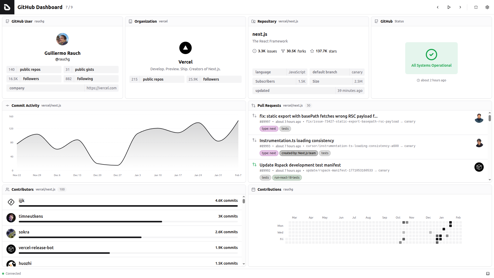
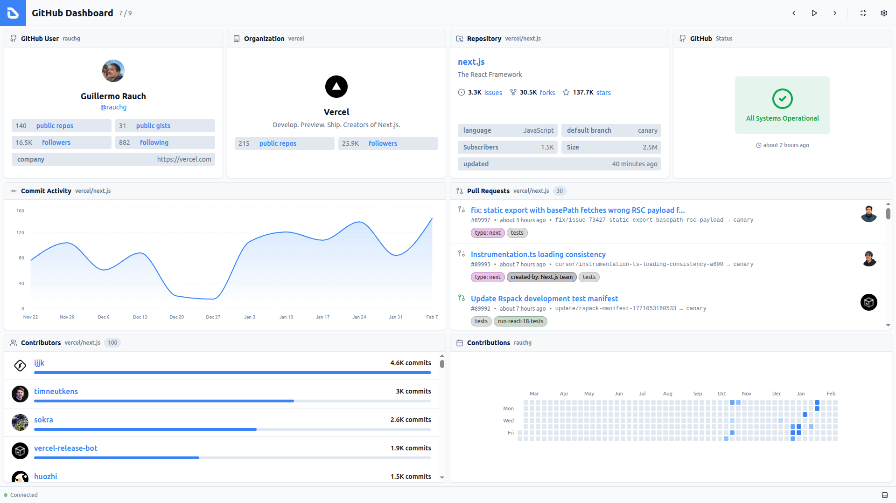
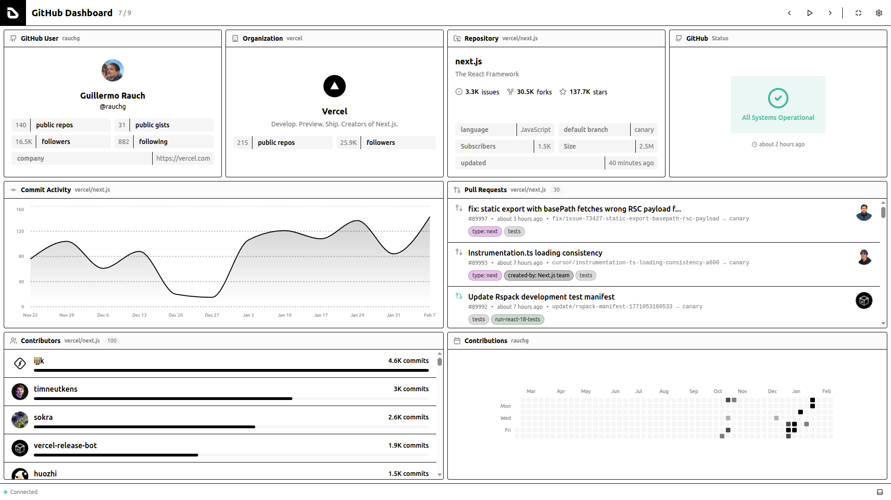
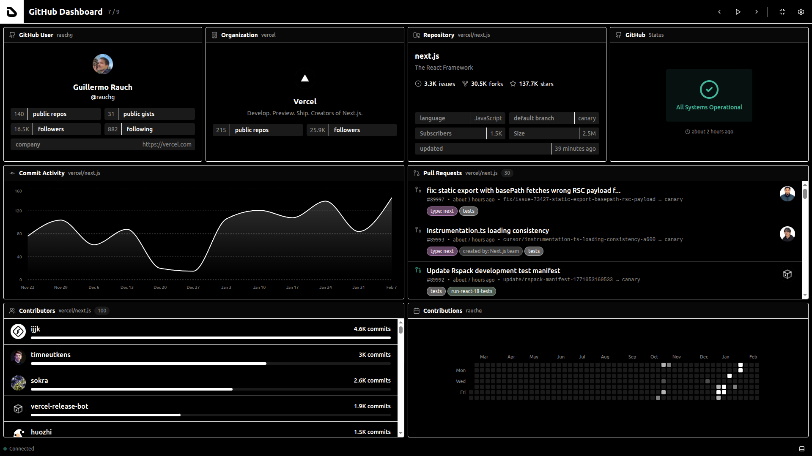
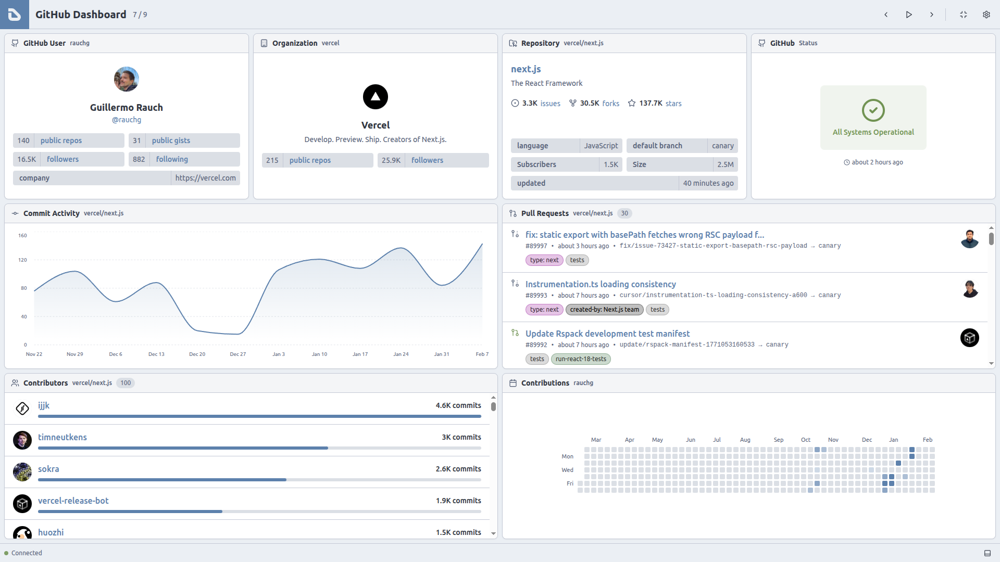
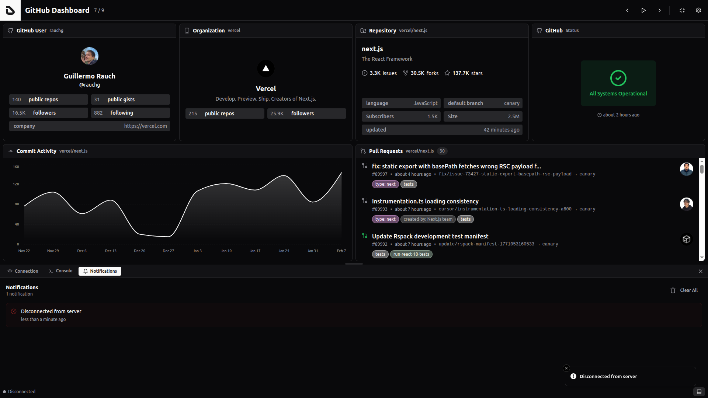

# Screenshots

This folder contains screenshots of the Dashfy:

<table>
  <tr>
    <td width="50%" align="center">
      
    </td>
    <td width="50%" align="center">
      
    </td>
  </tr>
  <tr>
    <td width="50%" align="center">Default Theme (Light)</td>
    <td width="50%" align="center">Default Theme (Dark)</td>
  </tr>
  <tr>
    <td width="50%" align="center">
      
    </td>
    <td width="50%" align="center">
      
    </td>
  </tr>
  <tr>
    <td width="50%" align="center">Midnight Blue Theme (Light)</td>
    <td width="50%" align="center">Midnight Blue Theme (Dark)</td>
  </tr>
  <tr>
    <td width="50%" align="center">
      
    </td>
    <td width="50%" align="center">
      
    </td>
  </tr>
  <tr>
    <td width="50%" align="center">Minimal Theme (Light)</td>
    <td width="50%" align="center">Minimal Theme (Dark)</td>
  </tr>
  <tr>
    <td width="50%" align="center">
      
    </td>
    <td width="50%" align="center">
      
    </td>
  </tr>
  <tr>
    <td width="50%" align="center">Nord Theme (Light)</td>
    <td width="50%" align="center">Nord Theme (Dark)</td>
  </tr>
  <tr>
    <td width="50%" align="center">
      
    </td>
    <td width="50%" align="center">
      
    </td>
  </tr>
  <tr>
    <td width="50%" align="center">Settings</td>
    <td width="50%" align="center">Connection Panel</td>
  </tr>
  <tr>
    <td width="50%" align="center">
      
    </td>
    <td width="50%" align="center">
      
    </td>
  </tr>
  <tr>
    <td width="50%" align="center">Console Panel</td>
    <td width="50%" align="center">Notifications Panel</td>
  </tr>
</table>
