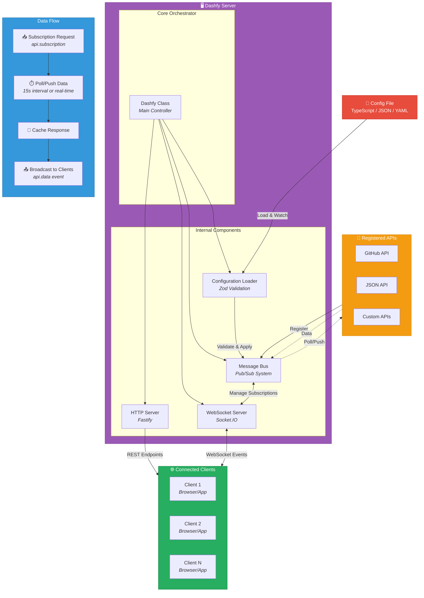

# `@dashfy/server`

> Dashfy server with real-time data streaming and multi-dashboard support.

## Introduction

`@dashfy/server` is the backend runtime for Dashfy dashboards. It handles configuration loading, API registration, real-time data streaming, and WebSocket communication with clients.

The server acts as the central orchestrator that:

- Loads dashboard configuration from `TypeScript` object / `JSON` / `YAML` files
- Connects to APIs and data sources through extensions
- Manages subscriptions and real-time updates
- Streams data to connected clients via WebSockets
- Provides HTTP endpoints for health checks and configuration

## Install

Install with your favorite package manager:

#### `npm`

```bash
npm install @dashfy/server
```

#### `pnpm`

```bash
pnpm add @dashfy/server
```

#### `yarn`

```bash
yarn add @dashfy/server
```

#### `bun`

```bash
bun add @dashfy/server
```

## Quick Start

Create a Dashfy server and load a dashboard configuration:

```ts
import { createJsonClient } from '@dashfy/ext-json'
import { createGitHubClient } from '@dashfy/ext-github'
import { Dashfy } from '@dashfy/server'

// Create server instance
const dashfy = new Dashfy()

// Load dashboard configuration from a file (JSON or YAML):
await dashfy.configureFromFile('./dashfy.config.yml')

// or from a TypeScript object:
// import type { DashfyConfig } from '@dashfy/types'
// const dashfyConfig: DashfyConfig = {...}
// dashfy.configure(dashfyConfig)

// Register JSON API
dashfy.registerApi('json', createJsonClient())

// Register GitHub API
dashfy.registerApi(
  'github',
  createGitHubClient({
    token: process.env.GITHUB_TOKEN!,
  }),
)

// Start server
await dashfy.start()
// Server running at http://0.0.0.0:5001
```

## Core Features

#### » Configuration Management

Load dashboard configuration from `TypeScript` object, `JSON` or `YAML` files with automatic format detection:

```ts
// Load from file
await dashfy.configureFromFile('./dashfy.config.json')

// Or provide config directly
dashfy.configure({
  dashboards: [
    {
      title: 'My Dashboard',
      columns: 3,
      rows: 2,
      widgets: [
        /* ... */
      ],
    },
  ],
})
```

**Hot-reload support**: Configuration changes are automatically detected and broadcast to connected clients.

```ts
// Enable hot-reload (default)
await dashfy.configureFromFile('./config.yaml', true)

// Disable hot-reload (production)
await dashfy.configureFromFile('./config.yaml', false)
```

#### » API Registration

Register custom APIs that widgets can subscribe to:

```ts
dashfy.registerApi('github', ({ logger, request }) => ({
  async repos(params: { user: string }) {
    logger.info({ user: params.user }, 'Fetching repositories')
    return request({
      url: `https://api.github.com/users/${params.user}/repos`,
    })
  },

  async stars(params: { owner: string; repo: string }) {
    const data = await request({
      url: `https://api.github.com/repos/${params.owner}/${params.repo}`,
    })
    return { stars: data.stargazers_count }
  },
}))
```

**API modes**:

- **Poll mode** (default): Periodically fetches data at configured intervals
- **Push mode**: Real-time streaming with callback-based producers

```ts
// Poll mode - fetches every 15 seconds (configurable)
dashfy.registerApi('weather', weatherApi, 'poll')

// Push mode - streams data as it arrives
dashfy.registerApi(
  'metrics',
  ({ logger }) => ({
    cpuUsage(callback: (data: unknown) => void) {
      const interval = setInterval(() => {
        callback({
          usage: process.cpuUsage(),
          timestamp: Date.now(),
        })
      }, 1000)

      return () => clearInterval(interval)
    },
  }),
  'push',
)
```

#### » Real-time Updates

Built on [Socket.IO](https://github.com/socketio/socket.io) for bidirectional [WebSocket](https://developer.mozilla.org/en-US/docs/Web/API/WebSockets_API) communication:

**Server → Client Events**:

- `configuration` - Dashboard config updates
- `api.data` - API response data
- `api.error` - API error messages

**Client → Server Events**:

- `api.subscription` - Subscribe to API method
- `api.unsubscription` - Unsubscribe from API method

**Subscription lifecycle**:

1. Client subscribes with `api`, `endpoint`, and an `id` (conventionally `api.method`, e.g. `github.stars`); routing uses `api` + `endpoint`, while `id` is the dedup/cache key
2. Server creates subscription if it doesn't exist (reusing it for later subscribers)
3. Immediate data fetch + periodic polling (poll mode) or callback setup (push mode)
4. Data is cached and broadcast to all subscribed clients
5. When last client unsubscribes, subscription is cleaned up

#### » Built-in Inspector API

The server automatically provides a `dashfy` API for system introspection:

```ts
// Widgets can subscribe to dashfy.inspector for monitoring
{
  apis: ['github', 'json', 'dashfy'],
  clientCount: 3,
  subscriptions: [
    {
      id: 'github.repos',
      clientCount: 2,
      hasCachedData: true,
      hasTimer: true
    }
  ],
  uptime: 3600,
  version: '0.1.0',
  nodeVersion: 'v20.11.0'
}
```

#### » HTTP Endpoints

When started, the server exposes:

| Endpoint    | Method | Description                                                    |
| ----------- | ------ | -------------------------------------------------------------- |
| `/config`   | GET    | Returns public configuration (excludes sensitive `apis` field) |
| `/health`   | GET    | Health check with uptime and timestamp                         |
| `/api/info` | GET    | Server info: registered APIs, client count, subscriptions      |

#### » Logging

Structured logging with [Pino](https://github.com/pinojs/pino):

```ts
import { Dashfy } from '@dashfy/server'
import pino from 'pino'

// Custom logger
const logger = pino({ level: 'debug' })
const dashfy = new Dashfy({ logger })
```

**Environment-aware defaults**:

- **Development**: Pretty-printed output (level: `info`)
- **Production**: JSON logs (level: `warn`)
- Respects `LOG_LEVEL` environment variable

#### » Integration with Existing Apps

Use an existing [Fastify](https://github.com/fastify/fastify) instance:

```ts
import Fastify from 'fastify'
import { Dashfy } from '@dashfy/server'

const app = Fastify()

// Add custom routes
app.get('/custom', async () => ({ message: 'Hello' }))

// Initialize Dashfy with existing app
const dashfy = new Dashfy({ app })
await dashfy.configureFromFile('./dashfy.config.json')
await dashfy.start()
```

## API Reference

### `Dashfy` Class

#### » Constructor

```ts
new Dashfy(options?: DashfyOptions)
```

**Options**:

- `logger?: Logger` - Custom Pino logger instance
- `app?: FastifyInstance` - Existing Fastify app to integrate with

#### » Methods

##### `configure(config: DashfyConfig): void`

Apply configuration object directly.

```ts
dashfy.configure({
  port: 3000,
  dashboards: [
    /* ... */
  ],
})
```

##### `configureFromFile(configPath: string, watchConfig = true): Promise<void>`

Load configuration from `JSON` or `YAML` file.

**Parameters**:

- `configPath` - Path to configuration file
- `watchConfig` - Enable hot-reload (default: `true`)

```ts
await dashfy.configureFromFile('./dashfy.config.yml', true)
```

##### `registerApi(id: string, api: APIRegistration, mode: PollMode = 'poll'): void`

Register a custom API for widgets to consume.

**Parameters**:

- `id` - Unique API identifier (e.g., `'github'`, `'weather'`)
- `api` - Factory function that returns API methods
- `mode` - `'poll'` (periodic) or `'push'` (real-time)

```ts
dashfy.registerApi('github', ({ logger, request }) => ({
  async repos(params: { user: string }) {
    return request({ url: `https://api.github.com/users/${params.user}/repos` })
  },
}))
```

##### `start(): Promise<void>`

Start HTTP and WebSocket servers.

**Port resolution** (in order):

1. `process.env.PORT`
2. `config.port`
3. Default: `5001`

**Host resolution** (in order):

1. `process.env.HOST`
2. `config.host`
3. Default: `0.0.0.0`

```ts
await dashfy.start()
// Server running at http://0.0.0.0:5001
```

##### `stop(): Promise<void>`

Graceful shutdown of all connections.

```ts
process.on('SIGTERM', async () => {
  await dashfy.stop()
  process.exit(0)
})
```

## Configuration Schema

```ts
interface DashfyConfig {
  port?: number // Server port (default: 5001)
  host?: string // Server host (default: '0.0.0.0')
  baseDir?: string // Base directory for static files
  rotationDuration?: number // Dashboard rotation interval (ms)
  theme?: string // Default theme ID
  dashboards: Array<{
    title?: string
    name?: string
    columns: number // Grid columns
    rows: number // Grid rows
    widgets: Array<{
      extension: string // Extension ID (e.g., 'github')
      widget: string // Widget name (e.g., 'RepoBadge')
      x: number // Grid X position
      y: number // Grid Y position
      columns: number // Widget width in columns
      rows: number // Widget height in rows
      title?: string // Widget title
      // ... widget-specific properties
    }>
  }>
  apis?: {
    pollInterval?: number // Global poll interval in ms (default: 15000)
  }
}
```

## API Registration

#### » API Factory Function

```ts
type APIClient = Record<string, (...args: any[]) => Promise<unknown>>

type CreatePushInterval = (options?: {
  interval?: number
}) => (
  key: string,
  callback: (data: unknown) => void,
  fetchFn: () => Promise<unknown>,
) => () => void

type APIRegistration = (dashfy: {
  logger: Logger
  request?: (options: RequestOptions) => Promise<unknown>
  createPushInterval?: CreatePushInterval
}) => APIClient
```

The factory receives three helpers:

- `logger` - Child [Pino](https://github.com/pinojs/pino) logger scoped to the API id
- `request` - HTTP client for fetching data (see [HTTP Request Utility](#http-request-utility))
- `createPushInterval` - Helper for building push-mode producers that poll a `fetchFn` on an interval (see [Push Mode](#-push-mode))

#### » Poll Mode (Default)

Periodic data fetching at configured intervals:

```ts
dashfy.registerApi(
  'weather',
  ({ request }) => ({
    async current(params: { city: string }) {
      return request({
        url: `https://api.weather.com/current?city=${params.city}`,
      })
    },
  }),
  'poll',
)
```

**Behavior**:

- Fetches data immediately on first subscription
- Polls at `pollInterval` (default: 15 seconds, configurable in config)
- Caches responses for instant delivery to new subscribers
- Stops polling when last client unsubscribes

#### » Push Mode

Real-time streaming with callback-based producers:

```ts
dashfy.registerApi(
  'metrics',
  ({ logger }) => ({
    cpuUsage(callback: (data: unknown) => void) {
      logger.info('Starting CPU monitoring')

      const interval = setInterval(() => {
        callback({
          usage: process.cpuUsage(),
          timestamp: Date.now(),
        })
      }, 1000)

      // Return cleanup function
      return () => {
        clearInterval(interval)
        logger.info('Stopped CPU monitoring')
      }
    },
  }),
  'push',
)
```

**Behavior**:

- Calls producer function on first subscription
- Producer receives callback to push data
- Data is broadcast to all subscribed clients
- Cleanup function called when last client unsubscribes

**Using `createPushInterval`**: Instead of managing timers by hand, use the injected `createPushInterval` helper to poll a `fetchFn` on an interval and push each result. It returns a disposer used for cleanup:

```ts
dashfy.registerApi(
  'metrics',
  ({ request, createPushInterval }) => {
    // Push every 2 seconds (default interval)
    const startPushInterval = createPushInterval!({ interval: 2000 })

    return {
      async prices(callback: (data: unknown) => void, params: { symbol: string }) {
        return startPushInterval(`prices:${params.symbol}`, callback, () =>
          request!({ url: `https://api.example.com/price/${params.symbol}` }),
        )
      },
    }
  },
  'push',
)
```

## HTTP Request Utility

The `request` utility provided to APIs is built on [Undici](https://github.com/nodejs/undici):

```ts
interface RequestOptions {
  url: string
  method?: 'GET' | 'POST' | 'PUT' | 'DELETE' | 'PATCH'
  headers?: Record<string, string>
  body?: unknown
  timeout?: number // Default: 10000ms
}
```

**Features**:

- Automatic JSON parsing
- Configurable timeout
- Error handling with status codes
- TypeScript-friendly

## Examples

#### » Basic Server

```ts
import { Dashfy } from '@dashfy/server'

const dashfy = new Dashfy()
await dashfy.configureFromFile('./dashfy.config.json')
await dashfy.start()
```

#### » With Custom Logger

```ts
import { Dashfy } from '@dashfy/server'
import pino from 'pino'

const logger = pino({ level: 'debug' })
const dashfy = new Dashfy({ logger })

await dashfy.configureFromFile('./config.yaml')
await dashfy.start()
```

#### » Multiple APIs

```ts
import { createJsonClient } from '@dashfy/ext-json'
import { createGitHubClient } from '@dashfy/ext-github'
import { createNbaClient } from '@dashfy/ext-nba'
import { Dashfy } from '@dashfy/server'

const dashfy = new Dashfy()
await dashfy.configureFromFile('./dashfy.config.yml')

// Register multiple APIs
dashfy.registerApi('json', createJsonClient())
dashfy.registerApi('github', createGitHubClient({ token: process.env.GITHUB_TOKEN! }))
dashfy.registerApi('nba', createNbaClient())

await dashfy.start()
```

#### » Custom API with Authentication

```ts
dashfy.registerApi('myapi', ({ request }) => ({
  async getData(params: { id: string }) {
    return request({
      url: `https://api.example.com/data/${params.id}`,
      headers: {
        Authorization: `Bearer ${process.env.API_TOKEN}`,
        'Content-Type': 'application/json',
      },
      timeout: 5000,
    })
  },
}))
```

#### » Graceful Shutdown

```ts
const dashfy = new Dashfy()
await dashfy.configureFromFile('./config.yaml')
await dashfy.start()

// Handle shutdown signals
process.on('SIGTERM', async () => {
  console.log('Shutting down gracefully...')
  await dashfy.stop()
  process.exit(0)
})

process.on('SIGINT', async () => {
  console.log('Shutting down gracefully...')
  await dashfy.stop()
  process.exit(0)
})
```

## Environment Variables

| Variable    | Description                                                        | Default                     |
| ----------- | ------------------------------------------------------------------ | --------------------------- |
| `PORT`      | Server port                                                        | `5001`                      |
| `HOST`      | Server host                                                        | `0.0.0.0`                   |
| `LOG_LEVEL` | Logging level (`trace`, `debug`, `info`, `warn`, `error`, `fatal`) | `info` (dev), `warn` (prod) |
| `NODE_ENV`  | Environment (`development`, `production`)                          | `development`               |

## Architecture

The server consists of several key components working together to power real-time dashboards:



### Components Overview

#### 1. **Dashfy Class**

Main orchestrator that manages HTTP server, WebSocket server, and message bus.

#### 2. **Message Bus**

Central pub/sub system that:

- Manages API registrations
- Tracks client connections
- Handles subscriptions
- Coordinates data streaming
- Caches responses

#### 3. **HTTP Server (Fastify)**

Provides REST endpoints and static file serving with CORS support.

#### 4. **WebSocket Server (Socket.IO)**

Real-time bidirectional communication with clients.

#### 5. **Configuration Loader**

Parses and validates `TypeScript` object / `JSON` / `YAML` configuration with Zod schema validation.

## Performance

The server is optimized for efficiency:

- **Shared subscriptions**: Multiple clients subscribing to the same API method share a single data stream
- **Response caching**: New subscribers receive cached data immediately
- **Automatic cleanup**: Unused subscriptions are removed to free resources
- **Configurable polling**: Adjust poll intervals per dashboard or globally
- **Connection pooling**: Efficient HTTP client (Undici) for API requests

## Error Handling

The server provides robust error handling:

- API failures don't crash the server
- Errors are logged with context
- Clients receive error messages via `api.error` events
- Type-safe error extraction with `getErrorMessage()`

## TypeScript Support

Fully typed with TypeScript:

```ts
import type { DashfyConfig, APIRegistration, PollMode } from '@dashfy/types'

const myApi: APIRegistration = ({ request }) => ({
  async fetchData(params: { id: string }) {
    return request({ url: `https://api.example.com/${params.id}` })
  },
})
```

## Development

```bash
# Install dependencies
pnpm install

# Build
pnpm build

# Watch mode
pnpm dev

# Run tests
pnpm test

# Type check
pnpm typecheck
```

## Community

Join the community on [Dashfy's Discord server](https://dashfy.dev/discord) to discuss the project, ask questions, or get help.

Join the conversation on X (Twitter) and follow [@dashfydev](https://x.com/dashfydev) for updates and announcements.

## License

This project is licensed under the AGPL-3.0 License - see the [LICENSE](./LICENSE) file for details.
